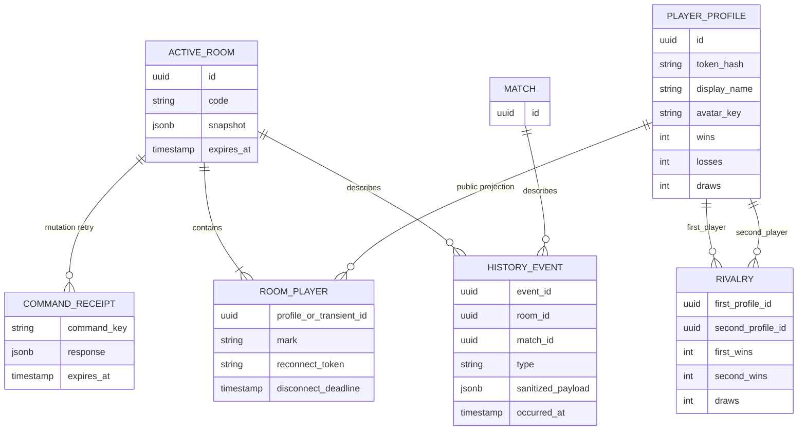
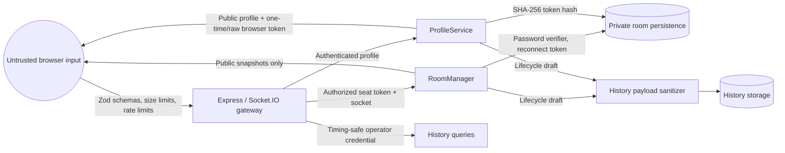
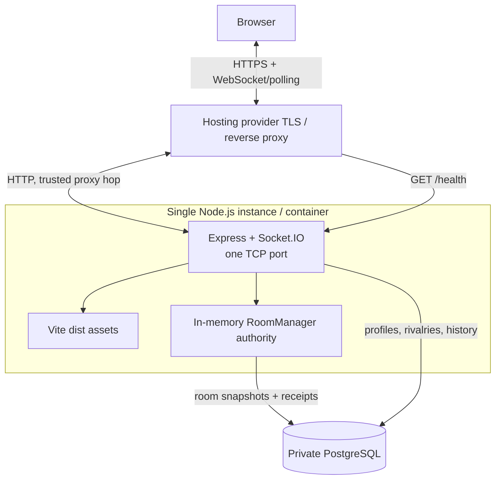

# Data and deployment architecture

## Data ownership

The diagram is conceptual: room players and match state are embedded in the
active-room snapshot rather than exposed through independent store interfaces.
Refer to the PostgreSQL adapters for physical table definitions.

### Store matrix

| Domain | Owner | Memory behavior | PostgreSQL behavior |
| --- | --- | --- | --- |
| Live rooms | `RoomManager` | Always authoritative in one process. | Snapshots restore a replacement process; PostgreSQL is not live authority. |
| Command receipts | `RoomManager` | Map entries expire after ten minutes. | Durable responses make retries idempotent across a restart until expiry. |
| Profiles and rivalries | `ProfileService` | Lost on restart. | Token hashes, public profile totals, and pair totals survive restart. |
| History | `HistoryRecorder` | Buffered/queryable only for process lifetime. | Batched event history and summaries survive according to retention settings. |

Storage selection is all-or-nothing through `DATABASE_URL`: each of the three
factory functions independently chooses its PostgreSQL adapter when the value
is present. Initialization creates the required tables. The adapters use the
same database but keep separate interfaces and lifecycle ownership.

## Data classification and trust boundaries

Security-relevant properties:

- Socket handshakes accept configured origins, same-host origins, and local
  development origins. Non-browser clients without an `Origin` header are
  accepted.
- Express limits JSON bodies to 10 KiB; Socket.IO limits messages to 10,000
  bytes. Socket commands are rate-limited per connection. New profile issuance
  is separately limited by client address, with `TRUST_PROXY` controlling
  address interpretation behind a proxy.
- Private-room passwords use `scrypt` with a random salt. Profile bearer tokens
  are stored as SHA-256 hashes. Comparisons use timing-safe equality where
  applicable.
- The operator key is accepted through `x-admin-api-key` or a Bearer header and
  held by the admin UI in session storage. Admin and profile responses disable
  caching.
- History sanitization excludes known sensitive key names. Event producers
  should still use internal room/match UUIDs and avoid placing credentials,
  room codes, socket IDs, or personal secrets in payloads.

## Production deployment

The multi-stage Docker build produces Vite assets and an ESM Node server, then
runs as the unprivileged `node` user. In production, Express serves the SPA and
falls back to `index.html` for HTML routes, including `/admin`. Render is
configured for one application instance and a private PostgreSQL database.
Health output reports room count and the backend/status of each persistence
subsystem.

## Availability and scaling constraints

The current architecture is deliberately **single-writer, single-instance**:

- Socket.IO rooms and broadcasts use the process-local adapter.
- The socket-to-seat index, disconnect timers, directory revision, command
  locks, persistence queues, and live room map are process-local.
- PostgreSQL snapshots are recovery checkpoints, not leases or compare-and-set
  ownership records.
- Two application instances could accept conflicting moves for the same room
  and could not reliably broadcast changes to each other's clients.

Before horizontal scaling, introduce one atomic room-authority strategy (for
example Redis-backed commands/locks or database transactions with fencing), a
cross-instance Socket.IO adapter, globally ordered directory delivery, and a
single owner for timers/expiry. Load-balancer stickiness alone is insufficient
because reconnects, lobby broadcasts, and process failure cross instance
boundaries. The broader product and scale sequence is documented in
`docs/scale-and-product-plan.md`.

## Failure behavior

| Failure | Current behavior |
| --- | --- |
| Browser loses transport | Seat is reserved for the disconnect grace period; Socket.IO retries and the client resumes with its saved token. |
| Node process restarts without PostgreSQL | Rooms, receipts, profiles, rivalries, and history are lost. |
| Node process restarts with PostgreSQL | Valid active rooms and receipts are restored; players begin disconnected and may resume before their deadlines. |
| PostgreSQL unavailable at startup | Store initialization fails and the server does not bind its listening port. |
| History write fails after startup | Recorder status can degrade; game authority remains separate from history recording. |
| Profile query/update fails | Profile-dependent entry or score update reports/logs failure; room authority remains in `RoomManager`. |
| Client misses a lobby delta | Revision gap triggers a full directory refresh. |
| Client retries a command | Cached receipt returns the prior response during the receipt TTL. |

## Observability and operations

- `GET /health` is the unauthenticated liveness/readiness surface used by the
  deployment manifest.
- `/admin` queries protected summary and paginated event endpoints for the
  configured reporting window.
- Lifecycle history includes service, room, player, match, round, move,
  disconnect, and recovery events with deployment identity when available.
- Graceful `SIGINT`/`SIGTERM` handling closes the HTTP server and domain
  services so queued persistence/history work can finish.
