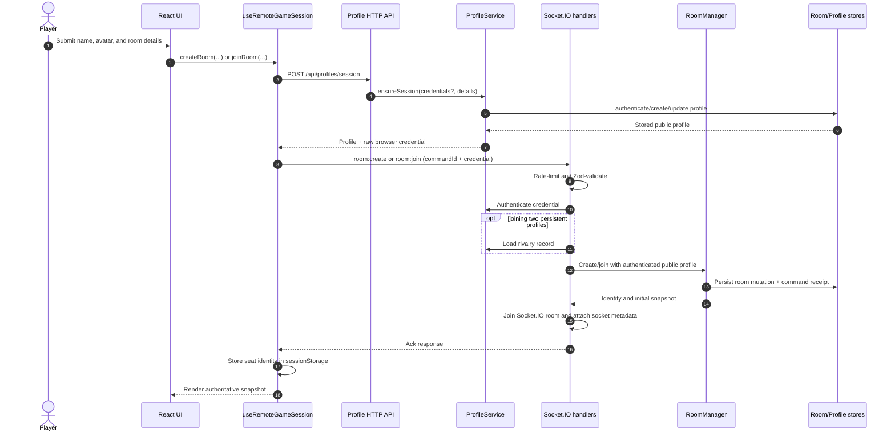
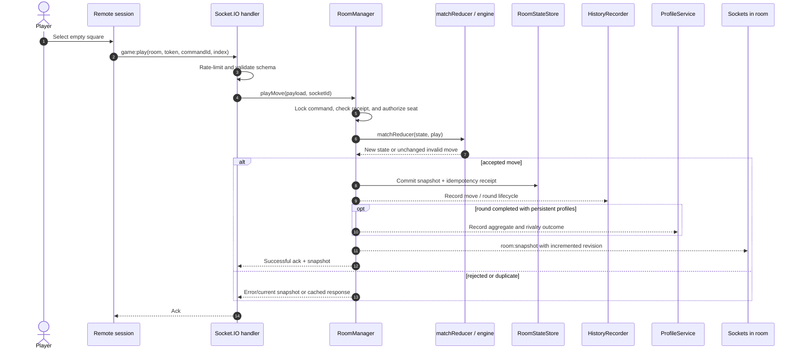
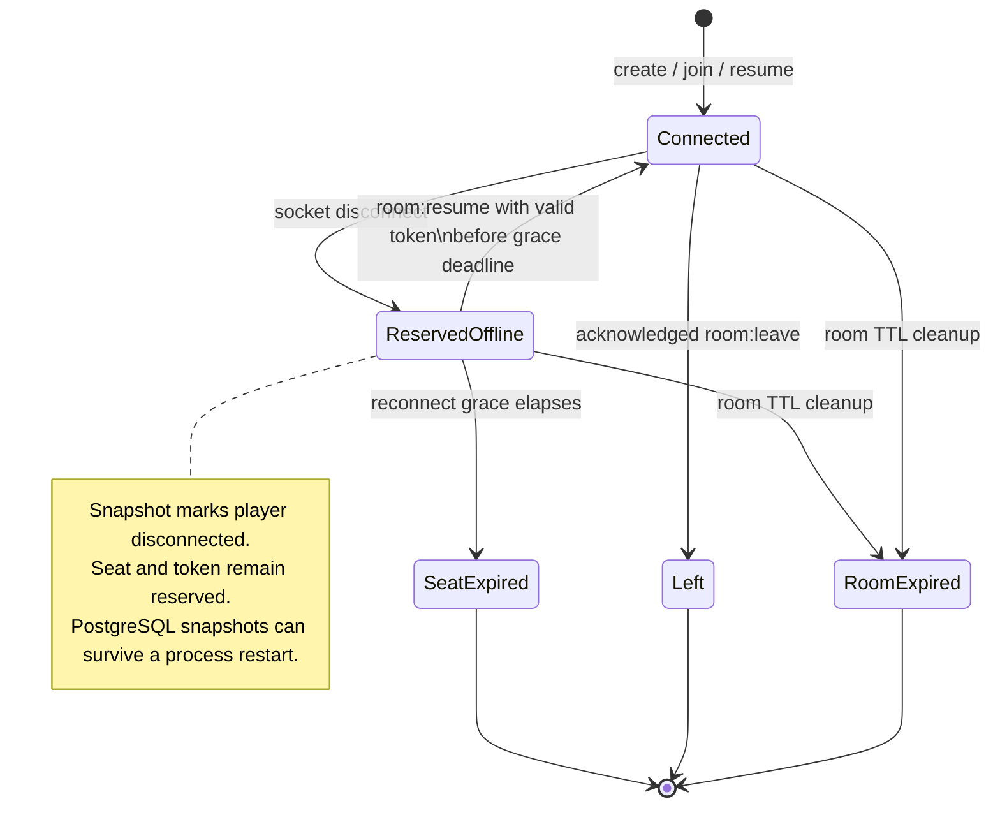
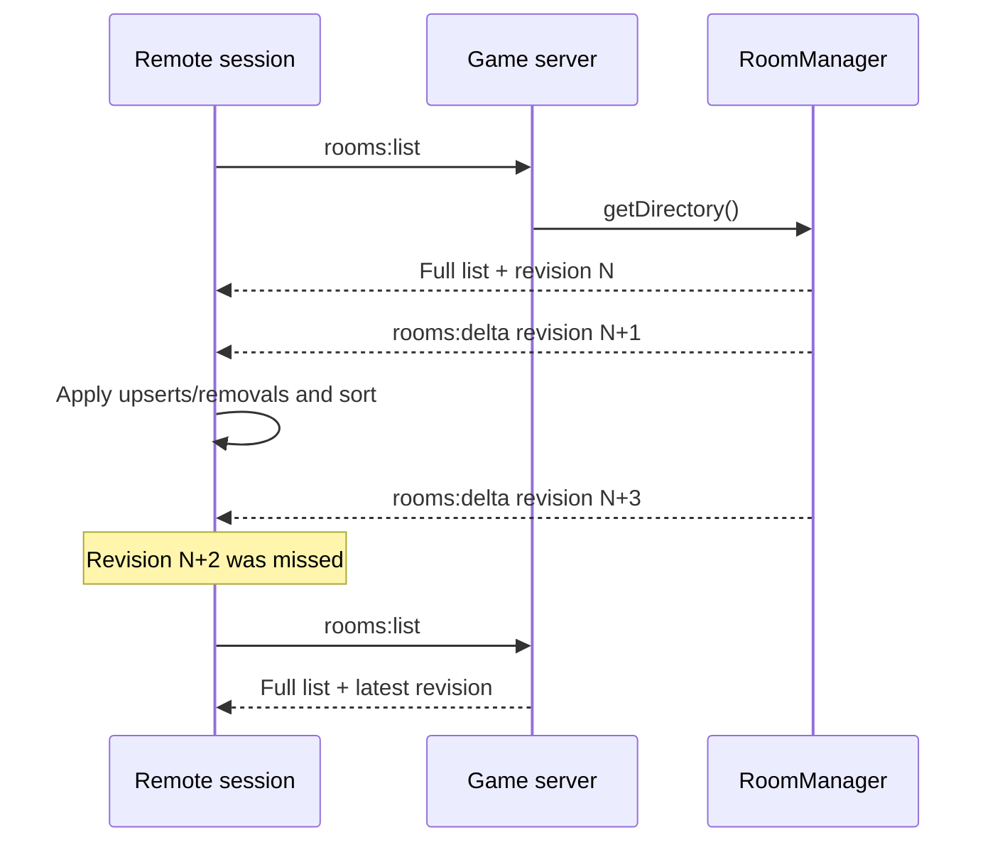
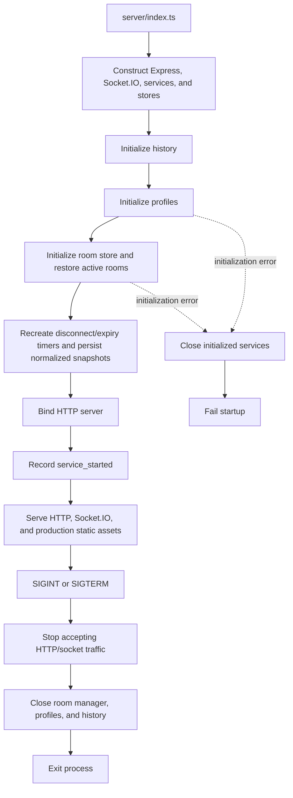

# Runtime flows

## Create or join an online room

The profile credential is browser-scoped and survives tabs/visits in local
storage. The room identity contains a seat reconnect token and is tab-scoped in
session storage. Create/join command IDs are retained in session storage long
enough to safely retry an uncertain request.

## Authoritative move and next round

After a completed round, each player sends `game:ready-next`. `RoomManager`
tracks readiness by mark and advances the reducer only when both occupied seats
are ready. The new round alternates the starting player. A command receipt
prevents a retry from applying the same action twice; persistence queues retain
per-room write ordering.

## Disconnect and resume

On transport disconnect, the server removes the socket index entry, marks the
seat offline, persists the deadline, and broadcasts state. The browser enters
`reconnecting`; after Socket.IO reconnects it sends `room:resume` with the
saved seat token. During process recovery all restored players begin offline,
and expiration timers are recreated from persisted deadlines.

## Lobby directory synchronization

Directory revisions are separate from each room's snapshot revision. The
client ignores old deltas, applies the next contiguous delta, and requests a
full directory whenever it sees a gap. Concurrent refresh requests are
coalesced by the remote-session hook.

## Service startup and shutdown

