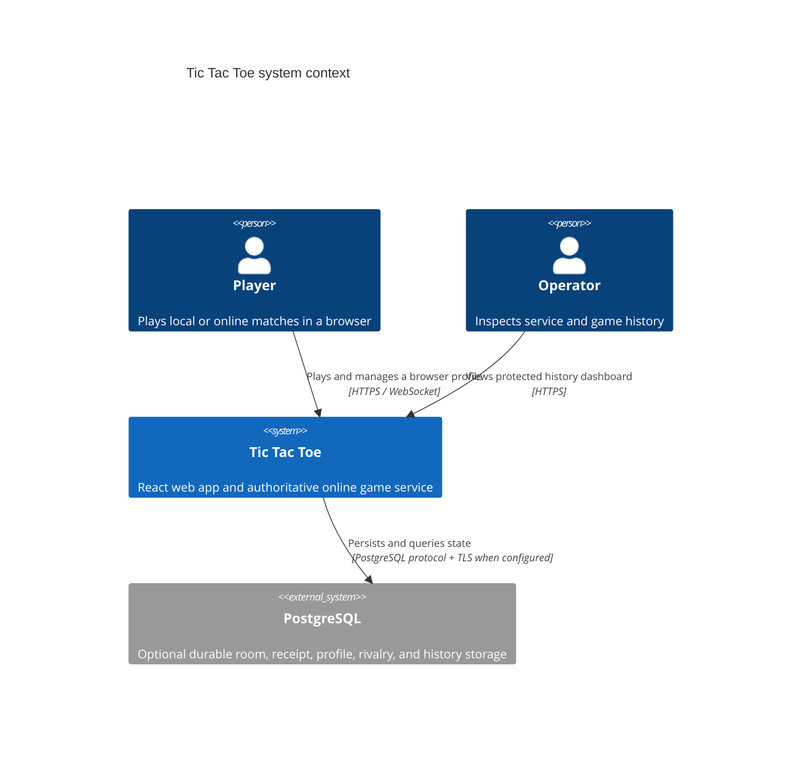
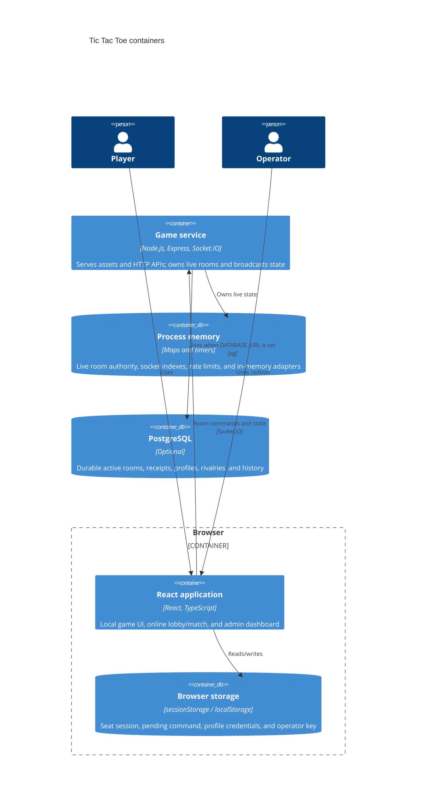
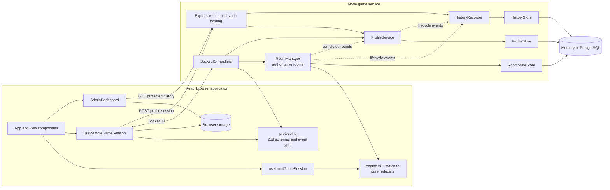

# System overview

## System context

In production, the browser assets, REST endpoints, and Socket.IO transport are
served from the same origin. During development, Vite serves the browser app
and proxies `/health` and `/socket.io` to the Node server; profile and admin API
calls require either a production-style server or a corresponding proxy/setup.

## Container view

## Component view

### Responsibilities and boundaries

- **UI components** render state and translate gestures into session actions;
  they do not validate authoritative online moves.
- **Session hooks** adapt local reducers or the remote protocol to the common
  `GameSession` shape used by the main game view.
- **Protocol module** is shared by browser and server. It couples compile-time
  Socket.IO event types with runtime Zod validation at trust boundaries.
- **Game reducers** are deterministic and environment-independent. The server
  reuses them to guarantee the same rules as local play.
- **Game server** owns transport concerns: origin checks, request validation,
  per-socket rate limiting, room membership, HTTP authentication, and startup/
  shutdown orchestration.
- **RoomManager** owns room authorization, seats, reconnect grace periods,
  match transitions, revisions, idempotent command receipts, persistence
  sequencing, and lifecycle callbacks.
- **ProfileService** authenticates hashed browser credentials, updates public
  profile information, and records aggregate and rivalry outcomes.
- **HistoryRecorder** sanitizes and buffers operational events before storage;
  admin reads go through its query methods.
- **Store interfaces** isolate domain services from memory/PostgreSQL adapters.

## Dependency direction

The shared game and protocol modules must not depend on React, Express,
Socket.IO server internals, or PostgreSQL. UI and server code depend inward on
those modules. Domain services depend on storage interfaces, while adapter
factories choose concrete implementations from environment configuration.
This direction keeps reducers unit-testable and lets server integration tests
inject in-memory stores.
